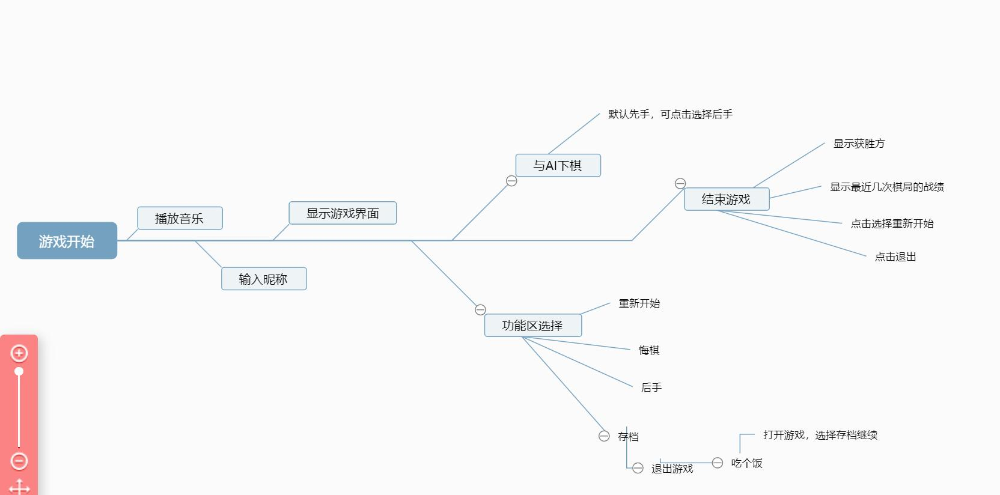
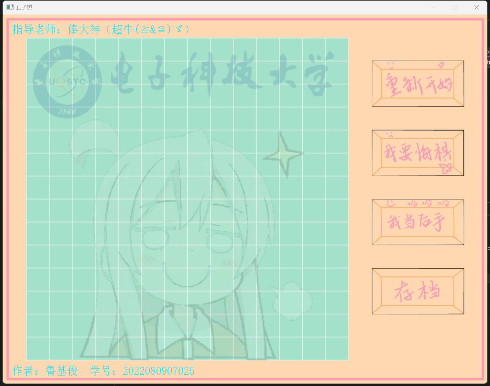
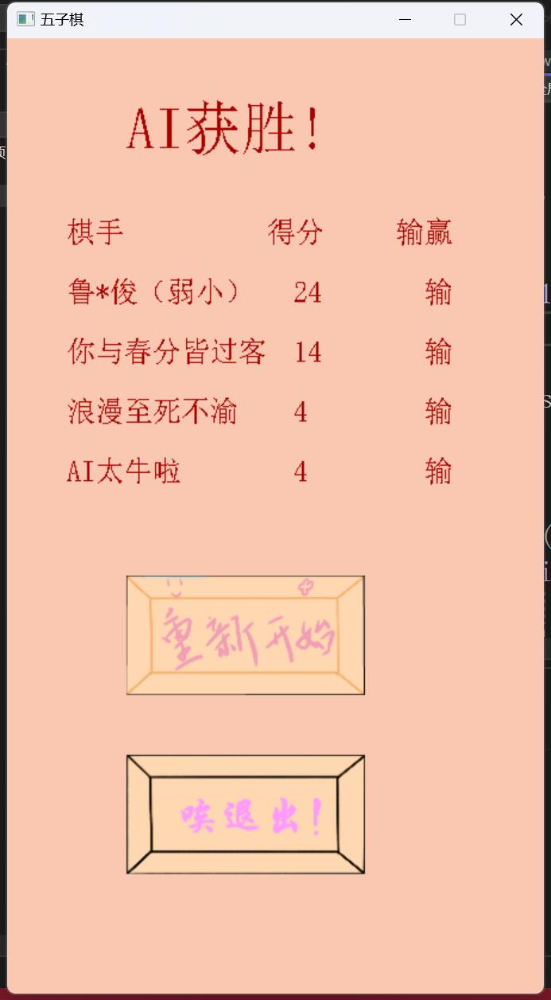
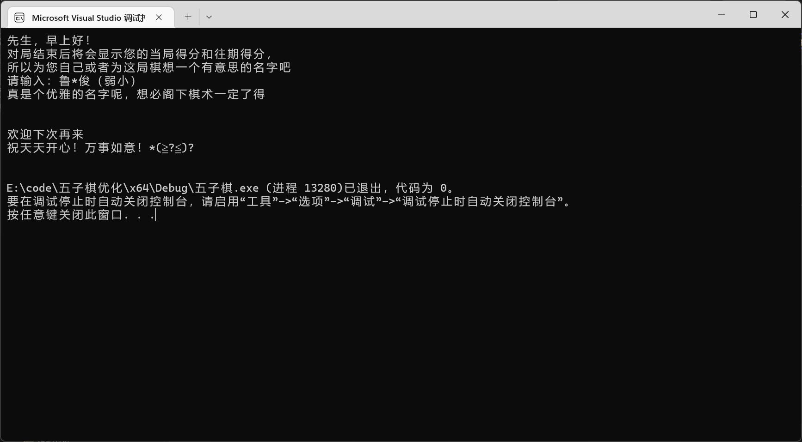
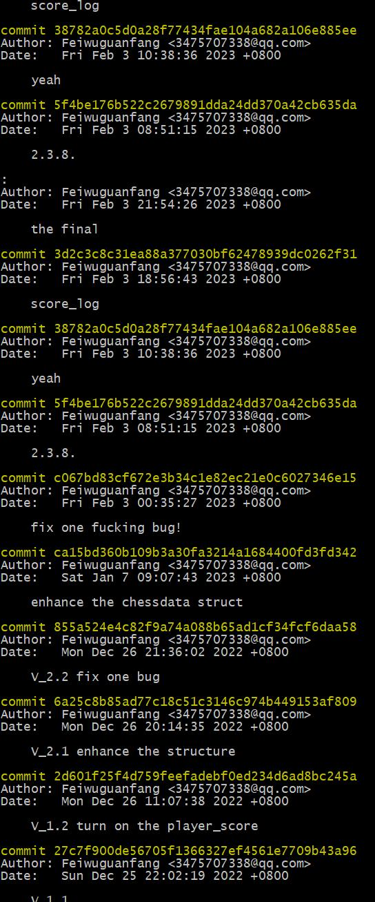

@[toc](目录)
# 五子棋AI实验报告
|姓名|学号|学院|
|:-:|:-:|:-:|
|鲁基俊|2022080907025|计算机学院
## 一、做什么（功能&规则）
### 游戏流程&规则

- 游戏开始时，会调出图形界面，可以点击选择重新开始游戏，或者是读取以前的存档（<font size=2>*默认存档为初始化，程序测试之后更新成了最近的一次存档*</font>）

- 重新开始后会先让玩家输入昵称，方便记录成绩并保存\
  

- 然后就是绘制棋盘，开始下棋，玩家默认的是黑棋和先手，可以点击后手功能按钮让AI先下。

- 功能区中，玩家可以点击“重新开始”按钮清空棋盘；可以点击“我要悔棋”进行悔棋回滚一步，暂不支持回滚多步＞﹏＜；可以点击“我当后手”按钮让AI先下，在下棋过程中也可点击“我当后手”按钮弃子不下；点击“存档”按钮将保存游戏进度、棋手昵称和分数并退出，待下次开局时选择“读档”按钮继续游戏；


- 在与AI苦战一番后输赢见分晓时，调出图形界面，显示获胜者，显示这一轮棋局的棋手、得分（<font size=2>*赢100分；输依据 回合数 给分*</font>）和输赢情况 并 显示出近期的三局棋的棋手、得分输赢情况。

- 图形界面中可以点击选择“重新开始”和“退出程序”，退出程序后打印出祝福语

- 游戏结束

## 二、怎么做
### 准备工作
- 工具：Visual Studio （集成开发环境）Adobe Photoshop(制作图片掩码；制作棋盘)
- 库：easyx图形库
- 开发环境配置：编辑、编译、运行都在Visual Studio中进行
### 模块划分
~~当时写代码的时候没有模块划分的意识，就是凭感觉分了一些函数出来><，现在看来有点偏离了“高内聚，低耦合”的说法＞﹏＜~~
- 模块总览：
1. 开始界面 模块（main.cpp)
2. 绘制棋盘&初始化 模块（creatmap.cpp)
3. 绘制透明图片模块（trasprent_img.cpp)
4. 棋手开始下棋 模块（beginchess.cpp)
5. AI下棋模块（robot.cpp)
6. 悔棋模块（backward.cpp）
7. 分数评估模块（score_access.cpp)
8. 判断输赢模块（ifwin.cpp)
9. 结束界面模块（over.cpp）
- 模块关系

### 功能实现
- 透明图片（光栅运算）
用PS将原始图片处理为掩码图片和主体图片，利用不同图像像素颜色进行位运算达到目的。掩码图片与背景进行与运算，保留背景和棋子主体阴影，主体图片再与之进行或运算，绘制图片主体部分，得到的就是带有背景的透明图片

利用putimage函数位运算模式将上述过程，抽象为一个puttrimage函数便于多次利用，代码如下：
```c
void puttrimage(int x, int y, const IMAGE* mask, const IMAGE* img)
{
	putimage(x, y, mask, SRCAND);
	putimage(x, y, img, SRCPAINT);
}
```
- 精准落棋（模糊算法）
鼠标左键点击时获取鼠标位置，计算出其距离左上方，右上方，左下方，右下方落棋点的距离，如果与任意落棋点距离小于0.4倍的棋格宽度，则视为有效点击返回TURE值，确认下棋
```c
bool clickboard(MOUSEMSG msg) {
	int lie = (msg.x - margin) / node_size;
	int hang = (msg.y - margin) / node_size;
	int lefttop_x = margin + lie * node_size;
	int lefttop_y = margin + hang * node_size;
	int selctpos = false,dis;
	do {
		for(int hh=0;hh<2;hh++)
			for (int ll = 0; ll < 2; ll++)
			{
				int posx = lefttop_x + hh*node_size;
				int posy = lefttop_y+ll*node_size;
				dis = sqrt((msg.x - posx) * (msg.x - posx) + (msg.y - posy) * (msg.y - posy));
				if (dis < ifdown) {
					clickposhang = hang+ll;
					clickposlie = lie+hh;
					selctpos = true;
					break;
				}
			}
	} while (0);
	if (game.chessmap[clickposhang+5][clickposlie+5] == -1 || game.chessmap[clickposhang+5][clickposlie+5] == 1)
		selctpos = 0;
	return selctpos;
}		
```
- 悔棋（贴图覆盖）
点击悔棋时会用与背景一样，大小略大于棋格的线条图覆盖住前一步棋手和AI下的棋子（~~感觉有点潦草(≧∇≦)ﾉ，哈哈~~），并将棋盘对应位置的状态改为空，覆盖后再追加一次棋手下棋
```c
void backward()
{
	IMAGE fugai;
	loadimage(&fugai, "wuzi/fugai1.jpg", node_size, node_size);
	int x = margin + (lie_est-5) * node_size - node_size / 2;
	int y = margin + (hang_est-5) * node_size - node_size / 2;
	putimage(x, y, &fugai);
	int x2 = margin + (clickposlie) * node_size - node_size / 2;
	int y2 = margin + (clickposhang) * node_size - node_size / 2;
	putimage(x2, y2, &fugai);
	game.chessmap[clickposhang+5][clickposlie+5] = 0;
	game.chessmap[hang_est][lie_est] = 0;
	MOUSEMSG msg2;
	while (1)
	{
		msg2 = GetMouseMsg();
		if (msg2.uMsg == WM_LBUTTONDOWN && clickboard(msg2) && msg2.x > 50 && msg2.x < 750 && msg2.y>50 && msg2.y < 750)
		{
			int x = margin + clickposlie * node_size - node_size / 2;
			int y = margin + clickposhang * node_size - node_size / 2;
			puttrimage(x, y, &b_mask, &chess_black);
			game.chessmap[clickposhang+5][clickposlie+5] = 1;
			if (ifwin(clickposhang, clickposlie, 1))
				loadimage(0, "wuzi/win.jpg");
			break;
		}
	}
}
```
- 后手
后手这个功能实现就很容易，点击按钮后直接break就可以了，然后AI下棋
```c
else if (msg.uMsg == WM_LBUTTONDOWN && msg.x > 800 && msg.x < 1000 && msg.y>400 && msg.y < 500)
			{
				break;
			}
		robot();
```
- 重新开始
这个功能也容易，就调用初始化和开始下棋函数就可以了
```c
  if (msg.uMsg == WM_LBUTTONDOWN && msg.x > 800 && msg.x < 1000 && msg.y>100 && msg.y <200)
			{
				init();
				begin();
				
			}
```
- 存档
<font size=2>*作为半个游戏爱好者，玩游戏怎么能不存档啊(⊙x⊙;)！尤其在下棋的时候，正焦灼对战着，突然喊吃饭怎么办，总不能浪费一局好棋吧＞︿＜，所以出于个人偏好，并且在平时作业中大概掌握了文件相关的操作，就做了这样一个功能。*</font>
点击存档后会将当局棋的局面、棋手和回合数记录下来，写入一个文本文件，得以后续读档
```c
else if (msg.uMsg == WM_LBUTTONDOWN && msg.x > 800 && msg.x < 1000 && msg.y>550 && msg.y < 650)
			{
				fopen_s(&precord, "存档.txt", "w");
				fprintf(precord, "%s\n%d\n", name1,turn);
				for (int a = 0; a < 25; a++)
				{
					for (int b = 0; b < 25; b++)
					{
						fprintf(precord, "%d\n", game.chessmap[a][b]);
					}
				}
				printf("\n以存档，继续游戏只需重新开始，选择读档，欢迎下次光临\n");
				exit(0);
				
			}
```
- 读档
开始界面，点击读档时会将文件中记录的相关数据读取到对应的变量当中，继续下棋，好耶\^o^！
```c
else if (msg1.uMsg == WM_LBUTTONDOWN && msg1.x > 50 && msg1.x < 450 && msg1.y>300 && msg1.y < 500)
		{
			init();
			fopen_s(&precord, "存档.txt", "rb");
			fscanf_s(precord, "%s", name1,30);
			fscanf_s(precord, "%d", &turn);
			for (int a = 0; a < 25; a++)
			{
				for (int b = 0; b < 25; b++)
				{
					fscanf_s(precord, "%d", &game.chessmap[a][b]);
					if (game.chessmap[a][b] == -1)
					{
						int x = margin + (b - 5) * node_size - node_size / 2;
						int y = margin + (a - 5) * node_size - node_size / 2;
						puttrimage(x, y, &w_mask, &chess_white);
					}
					else if(game.chessmap[a][b] ==1)
					{
						int x = margin + (b - 5) * node_size - node_size / 2;
						int y = margin + (a - 5) * node_size - node_size / 2;
						puttrimage(x, y, &b_mask, &chess_black);
					}
				}
			}
			fclose(precord);
			begin();
		}
```
- 保存&显示战绩
<font size=2>*讲到这个功能的实现，当时折腾了挺久的😟，还是对文件的相关操作了解不充分，对文件打开的模式有误解，一开始用追加模式'a'写入，查资料发现追加模式下不能在文件开头写入，而'r+'读写模式下可以在文件开头写入，改为了'r+'模式后, 发现原数据就被新数据覆盖了.再去查发现没有现成的既在文件开头写入又保留原有数据的模式＞﹏＜,再想一想,那不如就在文件尾部写入,只不过读取数据的时候会麻烦一点*</font>
用追加模式在原文件尾部记录当局战绩(棋手,分数,输赢)
```c
	fopen_s(&plog, "战绩.txt", "a");
	rewind(plog);
	fprintf(plog, "%s\n", name1);
	fprintf(plog, "%d\n",turn);
	initgraph(450,800);
	setbkcolor(RGB(250, 200, 177));
	cleardevice();
	settextstyle(50, 24, "宋体");
	settextcolor(RED);
	if (i == 1)
	{
		outtextxy(100, 50, "是平局欸");
		fprintf(plog, "%d\n",1);
	}
	else if (i == 2)
	{
		outtextxy(100, 50, "玩家获胜");
		fprintf(plog, "%d\n", 2);
	}
	else if (i == 3)
	{
		outtextxy(100, 50, "AI获胜!");
		fprintf(plog, "%d\n", 3);
	}
	fflush(plog);
	rewind(plog);
	fclose(plog);

```
*因为在文件尾部写入的战绩,那就不能简单的从头读取,从尾部读取感觉更麻烦,因为文件指针是往后移动的*那就...
搞一个循环语句:从文件头开始用一个字符数组按行读取数据,每循环一次变量text_line +1;读到文件结束,变量text_line值即为文件总行数,依据总行数推算出对局次数(一局记录三行数据)
```c
FILE* plog2;

	fopen_s(&plog2, "战绩.txt", "rb");
	int score_temp=0,ifwin_temp=0,text_line=0,time1;
	char name_temp[30]; char ch,test1;

	rewind(plog2);
	while (1)
	{
		test1 = fgetc(plog2);
		if (test1 == '\n')
		{
			text_line += 1;
		}
		else if (test1 == EOF)
			break;
	}
	rewind(plog2);
	time1 = (text_line + 1) / 3;
```
再根据对局次数,即可确定最新记录的数据位于哪一行,再用fgets函数移动到对应行开始读取数据. 然后读取前一场的数据时,只需将文件指针先rewind,在上次读取的基础上少往下读取三行,进行读取数据即可.以此类推得到此次和前三次的战绩数据并输出到屏幕上
```c
	char text_tem[30];

	for (int k = 0; k < 4; k++,time1--)
	{

		for (int m=1;m<time1;m++)
		{
			fgets(text_tem, 30, plog2);
			fgets(text_tem, 30, plog2);
			fgets(text_tem, 30, plog2);
		}
	
		ch = fgetc(plog2);
		if (ch == EOF)
		{
			break;
		}
		else
		{
			fseek(plog2, -1, SEEK_CUR);
			fscanf_s(plog2, "%s", name_temp,30);
			fscanf_s(plog2, "%d", &score_temp);
			fscanf_s(plog2, "%d", &ifwin_temp);
			rewind(plog2);
			settextstyle(25,12, "宋体");
			settextcolor(RED);
			if (ifwin_temp == 2)
				score_temp = 100;
			char num_s[6]; sprintf(num_s, "%d", score_temp);
		
			outtextxy(50,150, "棋手          得分     输赢  \n");
			outtextxy(50, 200+k*50,name_temp);
			outtextxy(240, 200 + k * 50, num_s);
			if (ifwin_temp == 1)
				outtextxy(350, 200 + k * 50, "和");
			else if (ifwin_temp == 2)
				outtextxy(350, 200 + k * 50, "赢");
			else if(ifwin_temp == 3)
				outtextxy(350, 200 + k * 50, "输");
		}
	
	}
	fclose(plog2);
```
## AI算法
### 算法实现
- 场面分数评估
首先对每一个点进行分数评估,再将整个图上的棋点分累加为棋面分
棋点评分时,若不为空,默认10分,再根据8个方向上的得分累加,每个方向上如果被相反颜色的子挡住,则该方向得分为零,若未被挡,则根据相连同色棋子个数指数式赋分,最后8个方向分数相加为该点预得分,若该点为白棋则该点得分等于预得分,若为黑棋该点实际得分为(预得分*-5)-5为防守加权分数
```c

int point_assess(int i, int j)
{
	if (game.chessmap[i][j] == 0)
		return 0;
	int f1 = 10, f2 = 10, f3 = 10, f4 = 10, f5 = 10, f6 = 10, f7 = 10, f8 = 10, m = 1, scorehan, q = 0;
	for (q = 1; game.chessmap[i + q][j] != -game.chessmap[i][j] && i + q < 20 && q < 5; q++)
	{
	}
	if (q < 5)
		f1 = 0;
	else
	{
		for (int a = 1; a <= 4; a++)
		{
			if (game.chessmap[i + a][j] == game.chessmap[i][j])
				m++;
			else
				break;
		}

		f1 = pow(10, m);

	}
	m = 1;
	for (q = 1; game.chessmap[i - q][j] != -game.chessmap[i][j] && i - q >4 && q < 5; q++)
	{
	}
	if (q < 5)
		f2 = 0;
	else
	{
		for (int a = 1; a <= 4; a++)
		{
			if (game.chessmap[i - a][j] == game.chessmap[i][j])
				m++;
			else
				break;
		}

		f2 = pow(10, m);

	}
	m = 1;
	for (q = 1; game.chessmap[i][j + q] != -game.chessmap[i][j] && j + q < 20 && q < 5; q++)
	{
	}
	if (q < 5)
		f3 = 0;
	else
	{
		for (int a = 1; a <= 4; a++)
		{
			if (game.chessmap[i][j + a] == game.chessmap[i][j])
				m++;
			else
				break;
		}

		f3 = pow(10, m);
	}
	m = 1;
	for (q = 1; game.chessmap[i][j - q] != -game.chessmap[i][j] && j - q > 4 && q < 5; q++)
	{
	}
	if (q < 5)
		f4 = 0;
	else
	{
		for (int a = 1; a <= 4; a++)
		{
			if (game.chessmap[i][j - a] == game.chessmap[i][j])
				m++;
			else
				break;
		}

		f4 = pow(10, m);
	}
	m = 1;
	for (q = 1; game.chessmap[i + q][j + q] != -game.chessmap[i][j] && i + q < 20 && q < 5 && j + q < 20; q++)
	{
	}
	if (q < 5)
		f5 = 0;
	else
	{
		for (int a = 1; a <= 4; a++)
		{
			if (game.chessmap[i + a][j + a] == game.chessmap[i][j])
				m++;
			else
				break;
		}

		f5 = pow(10, m);
	}
	m = 1;
	for (q = 1; game.chessmap[i - q][j - q] != -game.chessmap[i][j] && i - q > 4 && q < 5 && j - q>4; q++)
	{
	}
	if (q < 5)
		f6 = 0;
	else
	{
		for (int a = 1; a <= 4; a++)
		{
			if (game.chessmap[i - a][j - a] == game.chessmap[i][j])
				m++;
			else
				break;
		}

		f6 = pow(10, m);
	}
	m = 1;
	for (q = 1; game.chessmap[i + q][j - q] != -game.chessmap[i][j] && i + q < 20 && q < 5 && j - q>4; q++)
	{
	}
	if (q < 5)
		f7 = 0;
	else
	{
		for (int a = 1; a <= 4; a++)
		{
			if (game.chessmap[i + a][j - a] == game.chessmap[i][j])
				m++;
			else
				break;
		}

		f7 = pow(10, m);
	}
	m = 1;
	for (q = 1; game.chessmap[i - q][j + q] != -game.chessmap[i][j] && i - q > 4 && q < 5 && j + q < 20; q++)
	{
	}
	if (q < 5)
		f8 = 0;
	else
	{
		for (int a = 1; a <= 4; a++)
		{
			if (game.chessmap[i - a][j + a] == game.chessmap[i][j])
				m++;
			else
				break;
		}

		f8 = pow(10, m);
	}
	scorehan = f1 + f2 + f3 + f4 + f5 + f6 + f7 + f8;
	return scorehan;
}

```
再棋盘上每一点得分相加得到棋面总得分
```c

int  assessmap()
{
	int score_all = 0;
	for (int i = min1; i < max2; i++)
	{
		for (int j = min1; j < max2; j++)
		{

			if (game.chessmap[i][j] == 0)
				game.scoremap[i][j] = 0;
			else if (game.chessmap[i][j] == 1)//黑棋
			{
				game.scoremap[i][j] =point_assess(i, j)*( - 5);
			}
			else if (game.chessmap[i][j] == -1)//白棋
			{
				game.scoremap[i][j] = point_assess(i, j);
			}
		}
	}
	for (int i = min1; i < max2; i++)
	{
		for (int j = min1; j < max2; j++)
		{
			score_all = score_all + game.scoremap[i][j];
		}
	}
	return score_all;
}


```
- 极大极小值搜索
对于AI来说,棋面分值越大越好,对于玩家相反.那么假设AI下棋在任一点,玩家都会试图找到使棋面分值最低的点,在这种情况下AI就要选择将棋下在  *玩家下棋时最低分*  最高的那个点.  而更深层的搜索以此类推.
总之  AI就是要找到无论玩家怎么下,棋面分数最高的那个点. 玩家则相反
实现代码如下
```c
int temp2 = -1000000,t=0,m,n;
	for (int i = min1; i < max2; i++)
	{
		for (int j = min1; j < max2; j++)
		{

			if (game.chessmap[i][j] == 0)
			{
				t = 0;
				for (m = -1; m < 2; m++) {
					for (n = -1; n < 2; n++) {
						if (game.chessmap[i + m][j + n] != 0) {
							t++;
						}
					}
				}
				if (t != 0)
				{
					game.chessmap[i][j] = -1;
					if (ifwin(i, j, -1) == 1)
					{
						int x = margin + (j-5) * node_size - node_size / 2;
						int y = margin + (i-5) * node_size - node_size / 2;
						puttrimage(x, y, &w_mask, &chess_white);
						over(3);
						return;
						
					}
					int temp = deduction(1, 2, A, B);
					game.chessmap[i][j] = 0;
					if (temp > temp2)
					{
						hang_est = i;
						lie_est = j;
						temp2 = temp;
					}
				}
			}
		}
	}

 ```
- 偏僻点剪枝
如果某一点周围一个棋子都没有,那么AI必定不会下这点,直接剪枝,减少运算

  ```c
  for (i = -1; i < 2; i++)
     {
		for (j = -1; j < 2; j++) {
		if (game.chessmap[i + m][j + n]!= 0)
            {
					t++;     //偏僻点剪枝
			}
		}
	}
  ```

- α-β剪枝
就是说如果AI已经发现某一条分支的后续一定会比前面差时,直接减去这一分支,减小计算量.

图示如下


```c
int deduction(int sex,int depth,int a,int b)
{
	int m, n, i, j, t = 0, br = 0;
	long double va = 0;
	if (depth == 0||end()!=0)   
	{
		return assessmap();       
	}
	else if (sex  == 1)     //玩家回合
	{
		for (m = min1; m < max2; m++)
		{
			if (br == 1) {   
				break;
			}
			for (n =min1; n < max2; n++)
			{
				if (game.chessmap[m][n]== 0)   
				{
					if (turn < 80) {
						t = 0;
						for (i = -1; i < 2; i++) {
							for (j = -1; j < 2; j++) {
								if (game.chessmap[i + m][j + n]!= 0) {
									t++;     //偏僻点剪枝
								}
							}
						}
					}
					else {
						t = 1;
					}
					if (t == 0)   //偏僻
					{
						va = B;
					}
					else {
						game.chessmap[m][n] = 1;    //棋下在这个地方
						va = deduction(-sex, depth - 1, a, b);
						game.chessmap[m][n] = 0;      
					}
					if (va < b)    
					{
						b = va;
					}
					if (b < a)
					{
						break;    //b剪枝
						br = 1;
					}
				}
			}
		}
		return b; //返回分数
	}
	else if (sex ==-1)     //电脑回合
	{
		for (m = min1; m <max2; m++)
		{
			if (br == 1) {   //a剪枝 
				break;
			}
			for (n = min1; n <max2; n++)
			{
				if (game.chessmap[m][n] == 0)     //为空
				{
					if (turn < 80) {
						t = 0;
						for (i = -1; i < 2; i++) {
							for (j = -1; j < 2; j++) {
								if (game.chessmap[i + m][j + n] != 0) {
									t++;     //偏僻点剪枝
								}
							}
						}
					}
					else {
						t = 1;
					}
					if (t == 0)   //偏僻
					{
						va = A;
					}
					else {
						game.chessmap[m][n] = -1;     
						va = deduction( -sex, depth - 1, a, b);
						game.chessmap[m][n] = 0;   
					}
					if (va > a)   
					{
						a = va;
					}
					if (b < a)
					{
						break;    
						br = 1;
					}
				}
			}
		}
		return a;
	}
	return 0;

}
```
### AI智能水平
反正....我没赢过＞︿＜(不知道是开心还是伤心),这个AI就很能堵人,一不小心就没了...(和设置的防守加权数有关)
当前默认搜索深度为三层? 可以通过更改Robort.cpp中deducation函数的参数增加搜索的深度
## 其他
- 运行速度
流畅的很!
- 程序大小
源文件+头文件+资源文件=5.96MB
但不知道为什么整个文件夹有三个多G😣啊! 用git管理的原因??
- commit记录


通过这次实验,我真的真的深切的感受到git真是个好东西!!!!
## 参考资料
Alpha-Beta剪枝算法
https://www.bilibili.com/video/BV1Bf4y11758?vd_source=31a3bdf85d36e0b6e60d838aed64882c
搭建棋盘,落子判断
https://b23.tv/jiIi6z2
透明图片
http://t.csdn.cn/zTatD